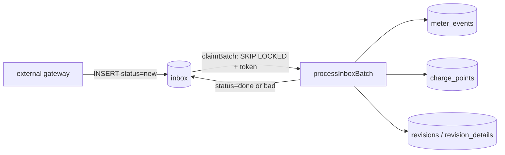

# Repository Guidelines

## Project Overview

`evse-ingest` is a PHP 8.2 CLI daemon that ingests and normalizes EV charge point (EVSE) telemetry. An external field-gateway layer lands raw JSON frames in a shared MySQL `inbox` table; this service claims batches, decodes them, updates charge point / connector state, writes `meter_events` rows, records a field-level `revisions` audit trail, and marks each frame `done` or `bad`.

Scale model: N independent worker processes, one per allotted core. There is **no coordination between instances beyond what MySQL enforces** (`FOR UPDATE SKIP LOCKED` + a status claim token).

## Companion Documentation

Human-oriented documentation lives in [`docs/`](docs/README.md). Prefer it for
background; prefer this file for rules when editing.

| Document | Use for |
|---|---|
| [docs/domain-overview.md](docs/domain-overview.md) | Domain vocabulary, data-plane position, frame field semantics, service guarantees and non-guarantees |
| [docs/architecture.md](docs/architecture.md) | System/container/component diagrams; the two-branch control flow inside `processInboxBatch()`; transaction model; scaling |
| [docs/sequence-diagrams.md](docs/sequence-diagrams.md) | Dataflows at six zoom levels, with real observed values |
| [docs/data-model.md](docs/data-model.md) | ERD, per-table reference, `inbox.status` state machine, seed data |
| [docs/known-issues.md](docs/known-issues.md) | Fifteen verified defects with reproductions — **read before editing `src/ingest.php`** |
| [docs/stability-spec.md](docs/stability-spec.md) | The invariants that MUST hold through any change: 75 numbered requirements with status and evidence, plus the bugs, latent bugs, and questionable behavior consumers may depend on |
| [docs/integration-points.md](docs/integration-points.md) | Every external touchpoint: all 27 SQL statements by id, the one outbound HTTP call, env vars, clocks, container coupling, cross-team contracts, risk register |
| [tests/README.md](tests/README.md) | Characterization suite: refactor vs bugfix workflow, and when a baseline may be re-recorded |
| [tests/property/README.md](tests/property/README.md) | Property suite: generated inputs, the invariants and oracles it checks, and how to promote a counterexample |

**Consistency:** `docs/` was cross-checked against this file and against `src/`. No contradictions were found across any pass. Findings surfaced by executing or exhaustively grepping the code rather than reading it — gotchas 4–7, 13, 17, 18 below — were added here; gotcha 3 was tightened from "inserts are skipped" to the stronger observed result (**zero** `meter_events` rows for the frame); gotcha 16 was widened once the full write inventory showed this service also `UPDATE`s and `INSERT`s into the upstream-owned `inbox` table. If you find a genuine conflict, verify against `src/` and fix both files.

## Architecture & Data Flow

Three files carry everything: `bin/worker.php` (loop), `src/db.php` (PDO + logging), `src/ingest.php` (all logic).



**Frame lifecycle** — `processInboxBatch()` (`src/ingest.php:48`) is the only entry point:

1. `claimBatch()` (`src/ingest.php:28`) — `SELECT id FROM inbox WHERE status='new' ... FOR UPDATE SKIP LOCKED` (`:34-38`), then `UPDATE inbox SET status = <token>` where token is `'c'` + 11 hex chars (`:30`). Commits, then re-reads the claimed rows **by token** (`:45`).
2. Idempotency guard — `SELECT id FROM meter_events WHERE inbox_id = ?`; if present, mark `done` and skip (`:70-81`).
3. `UPDATE charge_points SET last_seen_at` when `src != 'gw'` (`:85-90`).
4. `json_decode($body, true)` (`:92`). Frame keys are terse: `1` = `cp_ident`, `m` = metadata sub-object (`firmware`, `zd`, `la`, `lo`, `sw`), `msg_type`, `wh`, `la` (local event time), `rd`/`rh` (rollup date/hour), `nt` (fault note), `fl` (fault flag), `sv`/`hv` (sw/hw version), `dbg` (diagnostic blob), `as` (colon-delimited per-connector meter string), `md` (model), `rt` (tariff), `connector_count`.
5. Timezone normalization — build `dt` from `rd`+`rh` or `la` (`:130-135`), interpret in `charge_points.tz` (default `America/Chicago`), convert to UTC → `$utcEventAt` (`:137-142`).
6. `msg_type` dispatch (`:151-164`): `9`/`11` → `link_state = 1`; `14` → `link_state = 0` (all three also `flags = flags | 4`, never cleared); `3` with `la === null` → rewrite `inbox.received_at` to site-local now; `17` → overheat.
7. Fault synthesis (`:166-190`) — scan `nt` for `OVERHEAT` / `GROUND FAULT` / `CONNECTOR LOCK FAULT`; optionally call `fetchPostedTariff()`; parse `dbg` for `;A1;` / `;B1;` / `;C1;` markers.
8. Event write — **branches on `model_code`**: `== 7` (multi-connector) fans out one synthetic `inbox` row (status `done`) plus one `meter_events` row **per connector** (`:194-237`); otherwise a single `meter_events` insert (`:239-243`).
9. `UPDATE inbox SET status='done'` (`:247`), build `$chargePointUpdates` (`:249-257`), rollup advancement (`:261-283`), audit diff (`:323-333`), then **branch again** (`:335`/`:368`) — model 7 fans `revision_details` out per connector; everything else runs the dynamic `UPDATE charge_points` (`:371-379`). Commit at `:387`.

## Key Directories

| Path | Purpose |
|---|---|
| `bin/` | Executable entry points. Contains only `worker.php`. |
| `src/` | All application code: `db.php` (infrastructure), `ingest.php` (logic). |
| `sql/` | `schema.sql` — source of truth for the six tables, plus seed fleet data. |
| `tests/` | Two black-box suites plus their workflow docs, both Python. `harness/stack.py` is the driver they share. Nothing here references application source. |
| `scripts/` | Helpers the `Makefile` delegates to: `smoke.py`, `check-docs.py`. |

## Development Commands

Everything is wrapped by the root [`Makefile`](Makefile). Run `make` for the
target list. Prefer these over raw `docker compose` invocations.

```bash
make test        # both suites — the regression gate
make verify      # lint + doc links + both suites (pre-merge gate)
make test-char   # characterization only (~6 min)
make test-prop   # property only (~10 min)
make lint        # php -l on every source file, inside the container
make docs-check  # validate every internal doc link and heading anchor

make up          # start the stack (builds the image)
make smoke       # inject one frame end-to-end and report the result
make logs        # follow worker output
make db          # MySQL shell against the service database
make shell       # shell in the worker container
make rebuild     # rebuild + restart the worker after a code change
make down        # stop, keeping data
make nuke        # stop AND drop the data volume — required for schema changes
make clean       # tear down every stack and remove transient artefacts
```

Useful variables: `CASES='09-*'` filters characterization cases;
`SCENARIOS=100` and `SEED=20260907` control the property run;
`FILE=corpus/x.json` selects a counterexample for `make prop-replay`.

**`make char-record` refuses without `CONFIRM=1`.** That guard encodes the rule
in [`tests/README.md`](tests/README.md): re-recording during a refactor is how an
unreviewed behavior change gets committed. Only pass `CONFIRM=1` when the
behavior change is intended and you have read every
`tests/characterization/.results/*.diff`.

There is no build step, no package manager, and no host PHP. `Dockerfile` uses
`COPY . .` with no bind mount on `app`, so **code changes require `make rebuild`,
not a restart**. `sql/schema.sql` is mounted into `/docker-entrypoint-initdb.d/`,
which MySQL only executes on an empty volume, so schema changes require
`make nuke && make up`.

## Code Conventions & Common Patterns

- **Procedural PHP, global scope.** No namespaces, no Composer, no autoloader. New files must be `require_once __DIR__ . '/...'`'d explicitly (see `src/ingest.php:3`).
- **No `declare(strict_types=1)`, no parameter or return types anywhere.** Do not add them selectively; match the surrounding untyped style.
- 4-space indent, K&R braces. Functions and constants: `camelCase` and `UPPER_SNAKE_CASE`. Locals are predominantly `camelCase` with `snake_case` leftovers (`$batch_limit`, `$processed_count`) — prefer `camelCase` for new code.
- **All DB access goes through `Cx`** (`src/db.php:3`), never raw PDO. `ex()` and `q()` are byte-identical; `ex()` for writes / `q()` for reads is convention only. PDO is configured `ERRMODE_EXCEPTION`, `FETCH_ASSOC`, `EMULATE_PREPARES=false`, `utf8mb4`.
- **Prepared statements everywhere**, positional `?` placeholders (named `:t` only in the `revisions` insert). Two deliberate interpolations: `{$shard}`/`{$shards}`/`{$limit}` in the claim SQL (`:36-37`, safe via `(int)` casts) and backtick-quoted column names in the dynamic `UPDATE charge_points` (`:373`, keys come from code literals guarded by `array_key_exists($fieldName, $chargePoint)`).
- **`Cx` reference-counts transactions** (`src/db.php:10-31`). `begin()` inside an open transaction is a no-op, **not** a savepoint; `rollBack()` always unwinds the outermost transaction. Do not write code that depends on nested rollback.
- **Two separate connections** per batch: `$writeConnection` and `$readConnection` (`:50-51`). Reads may observe pre-transaction state.
- **Logging is `say()` only** (`src/db.php:67`) — `[<pid>] message` to **STDOUT**. Do not introduce `error_log`, STDERR writes, or a logger library.
- **Error handling:** per-row `catch (Exception)` (`:389-401`) and per-batch `catch` (`:404-411`). Both `say()` the message, roll back, and special-case `'Deadlock'` substring matching. `processInboxBatch()` returns bool; `bin/worker.php` ignores it and loops regardless.
- **Config is `getenv('X') ?: default`, always.** No `$_ENV`, no `$_SERVER`, no `.env`, no config file. Nothing fails hard on a missing variable.
- Audit rows are always `who=0`, `tname='ChargePoint'`, `op='U'`. `$revisionDetailRows` accumulates `[$revId, $col, $before, $after]` tuples and is flushed at the end; a `revisions` row must exist before its details.

### Environment variables

| Variable | Default | Read at | Notes |
|---|---|---|---|
| `DB_HOST` / `DB_PORT` / `DB_NAME` | `127.0.0.1` / `3306` / `evse` | `src/db.php:54-58` | |
| `DB_USER` / `DB_PASS` | `ingest_svc` / `ingest_svc` | `src/db.php:56-57` | README shows no default; code has one |
| `BATCH` | `4` | `src/ingest.php:59` | rows claimed per cycle; re-read every cycle |
| `POLL_INTERVAL_US` | `250000` | `bin/worker.php:12` | read **once** at startup |
| `LOOKUP_URL` | unset | `src/ingest.php:11` | tariff service base URL; **undocumented in README** |
| `SHARD` / `SHARDS` | `0` / `1` | `src/ingest.php:31-32` | `CRC32(cp_ident) % SHARDS = SHARD`; **undocumented in README** |

## Important Files

- `bin/worker.php` — entry point. `require_once` of `src/ingest.php` (which transitively pulls `src/db.php`), then `while (true) { processInboxBatch(true); usleep($pollIntervalUs); }`. No shebang, no signal handling, no top-level try/catch; crash recovery is `restart: unless-stopped` in compose.
- `src/ingest.php` — `fetchPostedTariff()` (`:8`), `claimBatch()` (`:28`), `processInboxBatch()` (`:48`, a single ~365-line function, 5+ nesting levels). Constants `PER_CONNECTOR_FIELDS = ['wh','raw','firmware']` and `PER_POINT_FIELDS = ['fault_note','alerted_at']` (`:5-6`) drive the model-7 audit split.
- `src/db.php` — class `Cx`, `conn()`, `say()`.
- `sql/schema.sql` — six tables. `charge_points.id` is plain `INT PRIMARY KEY` (**not** AUTO_INCREMENT — inserts must supply an id). `inbox.status` is `VARCHAR(16)`, **not an enum**. `meter_events` has live FKs to `charge_points` and `inbox`; `revisions` is polymorphic (`tname` + `target_id`) so it has no FK by design. Seed fleet: `CP-0001`–`CP-0004` (ids 1–4, `model_code` 0/7/0/253) and `CP-0010`–`CP-0021`; three `connectors` rows under `cp_id = 2`.
- `Makefile` — the single entry point for every development command. `make` lists targets; `make char-record` is guarded by `CONFIRM=1`.
- `docker-compose.yml` — `db` healthcheck gates `app` via `depends_on: service_healthy`. `BATCH`, `POLL_INTERVAL_US`, `LOOKUP_URL`, `SHARD`, `SHARDS` are not set here and fall back to code defaults.

### Minimum surface to preserve when refactoring `src/`

`processInboxBatch($runOnce, $onlyScanId = null)`, `conn()`, and `say()` must remain globally callable plain functions, and `src/ingest.php` must keep requiring `src/db.php` — `bin/worker.php` does not require it directly.

## Runtime/Tooling Preferences

- **PHP 8.2 CLI with `pdo_mysql`** (`Dockerfile`: `php:8.2-cli`). `ext-curl` is enabled by the base image, so the `LOOKUP_URL` path works.
- **MySQL 8.0, InnoDB.** `SKIP LOCKED` is required, so 8.0+ is a hard floor.
- **No PHP on the host machine** — always shell into a container to run `php`.
- **No Composer, no `vendor/`, no dependencies.** Keep it that way unless explicitly asked; adding a library means introducing an entire toolchain.
- **Absent by design or omission** — do not scaffold these unprompted: `composer.json`, `.dockerignore`, `.env`/`.env.example`, migration tooling, `phpstan`/`psalm`/`php-cs-fixer`/`phpcs` configs, CI workflows, `.editorconfig`. There is also **no `.git` directory**, so edits are not revertible — be conservative with destructive changes. A [`Makefile`](Makefile) **does** exist and wraps every development command; use it rather than adding a second runner.

## Testing & QA

**Two automated suites exist.** There is still no unit-test framework, no CI, no linter, and no coverage tooling.

- [`tests/characterization/`](tests/characterization/) — 26 golden-baseline cases pinning known inputs exactly.
- [`tests/property/`](tests/property/) — generated inputs checked against invariants and narrow oracles. No production data exists to sample, so its input domains are reconstructed from how the code consumes each field. It found gotchas 20 and 21.

Both are regression gates; both must be green before a change lands.

Commands are in [Development Commands](#development-commands). Both suites are
black-box: they build the real image, drive the real schema on a disposable
MySQL container, mock the one outbound HTTP dependency, and assert observable
state only after each batch quiesces. Neither references application source, so
neither depends on the implementation language.

`make test` needs `docker`, `make`, and `python3` — no host PHP, no `jq`, no
bash 4. It exits `0` only when every baseline matches byte-for-byte and every
declared assertion holds.

**Which workflow applies is decided by the suite, not by intent** — full detail in [`tests/README.md`](tests/README.md):

- **Refactoring** (no behavior change): `make test` before and after. It must stay green. **Never run `make char-record` during a refactor** — that is how an unreviewed behavior change gets committed, which is why the target demands `CONFIRM=1`.
- **Bugfix or feature** (behavior changes on purpose): first edit or add a case pinning the intended new behavior, make the change, `make test`, read every `tests/characterization/.results/*.diff`, then `make char-record CONFIRM=1` and commit code plus baseline diff together. Also update `docs/known-issues.md`, the matching gotcha here, [`docs/stability-spec.md`](docs/stability-spec.md), and notify the teams named in [docs/integration-points.md](docs/integration-points.md#implicit-cross-team-contracts).

For a one-off manual probe use `make smoke`, which injects a frame and prints the resulting rows. Hand-rolled `inbox` INSERTs must supply `src`, `cp_ident`, `body`, `body_hash`, and `received_at` — all `NOT NULL` with no default. Status must be exactly `'new'` or the worker never sees the row. Use `CP-0002` to exercise the multi-connector (`model_code = 7`) path. Note `bin/seed.php` does not exist despite the README referencing it; `make smoke` is its replacement.

**Cases are data, not code** (`cases/*.json`), and the harness never references application source — the suite is independent of the implementation language.

## Gotchas

Load-bearing traps, all verified by execution unless noted. Items 1–8 were reproduced against a live stack; 12, 19, 20 and 21 by the automated suites (20 and 21 were *discovered* by the property suite, not by reading); 13, 17 and 18 by exhaustive grep plus runtime inspection of the container; the rest are read from source. Reproductions in [docs/known-issues.md](docs/known-issues.md); full touchpoint inventory in [docs/integration-points.md](docs/integration-points.md).

1. **Claimed rows can strand — and take their whole batch with them.** A non-deadlock exception returns without marking the row `done` or `bad` (`:400`), leaving `status` = the worker's token. No reaper exists, and no other worker will pick it up (`status != 'new'`). Same on hard crash. The `return` also abandons every later frame in the batch (gotcha 20). Recovery is a manual `UPDATE inbox SET status='new' WHERE status NOT IN ('new','done','bad')`.
2. **`model_code == 7` skips the `charge_points` UPDATE entirely** (`:335` vs `:368`), unless `msg_type == 3`. Multi-connector units therefore never get `wh`, `fault_note`, `firmware`, etc. persisted to the parent row — only `revision_details`. *Observed:* after ingesting a `CP-0002` frame carrying `wh: 900`, `charge_points` row 2 still read `wh=0, local_event_at=NULL, last_event_id=NULL`.
3. **A model-7 frame can silently produce zero `meter_events`.** `:225` looks up `charge_points WHERE cp_ident = <connector_ident>`, but the seed data creates `connectors` rows `CP-0002-1..3` with no matching `charge_points` rows, so every per-connector insert is skipped — and because the model-7 branch *replaces* the single parent insert at `:239`, nothing is written at all. *Observed:* the `CP-0002` frame was marked `done`, three synthetic `inbox` rows appeared, `meter_events` gained **0** rows, and the worker logged nothing. Any change here must be validated against a `model_code = 7` unit, not just `CP-0001`.
4. **A model-7 frame can write an `inbox` id into `charge_points.last_event_id`.** `:245` takes `lastId()` from the connection right after the insert branch; on the fan-out path the last statement is a synthetic `inbox` insert (or a per-connector `meter_events` insert), not the parent's event. It is persisted whenever branch 2 takes the `else` path, i.e. `msg_type == 3`. *Observed:* a `msg_type 3` frame for `CP-0002` left `charge_points.last_event_id = 4` while `meter_events` was **empty** — id 4 was the synthetic `inbox` row. There is no FK on that column, so nothing catches it.
5. **`m.zd` in frame metadata suppresses all event writing on model-7 units.** The whole fan-out block is wrapped in `if (!$connectorDescriptor)` (`:195`), and the simple insert at `:239` is unreachable for `model_code == 7`. *Observed:* a frame with `"m":{"zd":"Z1"}` produced no synthetic rows, no `meter_events`, no parent update — and was marked `done`. No code path consumes a supplied descriptor; its only effect is suppression.
6. **Rejected frames still bump `last_seen_at`** when `src != 'gw'`. The liveness write at `:88` precedes decode and validation and commits on the `bad` path. *Observed:* a garbage frame with `src='cp'` moved `CP-0010.last_seen_at` from `NULL` to a real timestamp and then went `bad`; the same frame with `src='gw'` left it `NULL`.
7. **`charge_points.rollup_at` never advances for `rd`/`rh`-style frames.** The guard at `:275` requires `local_event_at` in the update set, and that is only populated from frame key `la` (`:251`). *Observed:* a `rd`/`rh` frame wrote `meter_events.rollup_date/rollup_hour` correctly but left `rollup_at` and `local_event_at` `NULL`.
8. **Synthetic model-7 `inbox` rows reuse the parent's `body_hash`** (`:219`) even though the body is patched, and the patch is brittle string surgery on `,` / `"1"` (`:211-217`) rather than JSON re-encoding. *Observed:* inbox ids 1–4 all carried the identical `body_hash`, so `body_hash` cannot be used for deduplication.
9. **`strpos()` truthiness bug at `:168`** — `strpos($nt, 'GROUND FAULT')` without `!== false` misses a match at offset 0. Note `:186-188` synthesizes notes that begin with exactly those strings.
10. **`rtrim()` result discarded at `:189`** — the trailing-space trim on the synthesized `nt` has no effect.
11. **`$existing_rollup_row` can be undefined** at `:276` when `wh` is absent from the update set (`:267` guards its assignment).
12. **Audit details queued before their `revisions` header are dropped, but nothing is lost.** Rows appended with a `NULL` `rev_id` (`:171`, `:175`) are skipped by both flush loops (`:360`, `:381`). Characterization testing showed the drop has **no observable effect**: an equivalent row is always written later in the same frame, by the alert gate at `:311` when it passes or by the generic diff loop at `:330` when it fails. Dead weight worth deleting, not a correctness defect. Note also what the `:307` gate really controls — when it **passes**, `fault_note` is *not* persisted to the parent row (`:313` unsets it) and `alerted_at` *is* set; when it **fails**, the note *is* persisted and no alert is raised. That is the opposite of what "suppression" suggests.
13. **`fetchPostedTariff()` sets no curl timeout** (`:13-16` — only `CURLOPT_URL` and `CURLOPT_RETURNTRANSFER`). curl's default is `0`, i.e. no limit, so an unresponsive `LOOKUP_URL` blocks the worker **indefinitely** while holding row locks inside the open write transaction (`begin()` at `:83`). Peers contending on those rows hit `innodb_lock_wait_timeout` (observed 50s) and strand their own frames. When `LOOKUP_URL` is unset it instead sleeps 120–210 ms and returns null — still inside the transaction.
14. **`$onlyScanId` (`:48`) and `$processed_count` (`:53`) are dead.** The parameter is never read; the counter is never returned.
15. **`firmware` is truncated to a major version** before storage — `ltrim(explode('-', $fw)[0], 'v')` (`:319`).
16. **`inbox` is externally owned, but this service writes to it three ways.** Beyond status transitions it `UPDATE`s upstream-authored `received_at` (`:161`) and `INSERT`s wholly new rows during fan-out (`:218`). Do not add FKs from `inbox`, and coordinate any column change — or any change to fan-out row shape — with the field-gateway team. Downstream readers (reporting, settlement) do not own migrations against this schema.
17. **`connectors` is read-only to this service.** It appears exactly once in the entire codebase — the SELECT at `:196` — and is never inserted, updated, or deleted. Connector provisioning, retirement, and the per-connector `charge_points` rows the fan-out path needs all happen outside this repo. Do not assume a code path exists to create them.
18. **Two independent clocks write into these tables.** `revisions.at_` comes from MySQL's `NOW()` (`:149`, `:263`, `:287`); every other timestamp comes from PHP's clock in PHP's default timezone. Both are UTC in the shipped stack (verified), but they are configured separately — a `TZ` env var or `php.ini` override moves one and not the other. See [docs/integration-points.md](docs/integration-points.md#clocks-and-timezones).
19. **Every rollup advance writes two identical `revision_details` rows.** `rollup_at` is appended explicitly at `:277` and then again by the generic diff loop at `:330`, because it is now a key in `$chargePointUpdates`. Same `rev_id`, `col`, `before_`, `after_`; both inserted. Visible in every recorded baseline and asserted by suite case 01. Anything counting or replaying audit rows double-counts rollups.
20. **One malformed frame strands every later frame in its batch.** The per-frame `catch` at `:389` does not `continue` — both branches `return` out of `processInboxBatch` from inside the `foreach` at `:63` (`:397`, `:400`). Later frames already carry the claim token, so nobody revisits them: one bad frame destroys up to `BATCH - 1` valid ones (three at the production default, thirty-one in the test config). Only the throwing frame logs `ERR`, so the casualties are invisible. Found by the property suite; pinned by characterization case 25. Detection must count rows per token, not just check for existence.
21. **An empty or non-numeric `as` segment strands multi-connector frames.** `:200` splits `as` on `:`; an empty value gives `[""]`, and `:228` inserts `''` into `meter_events.wh` (`INT`), which MySQL rejects under `STRICT_TRANS_TABLES` — `1366 Incorrect integer value`. Currently **masked by gotcha 3**: with no per-connector `charge_points` rows the insert is skipped. Fixing gotcha 3 will expose this. Pinned by characterization case 26.
