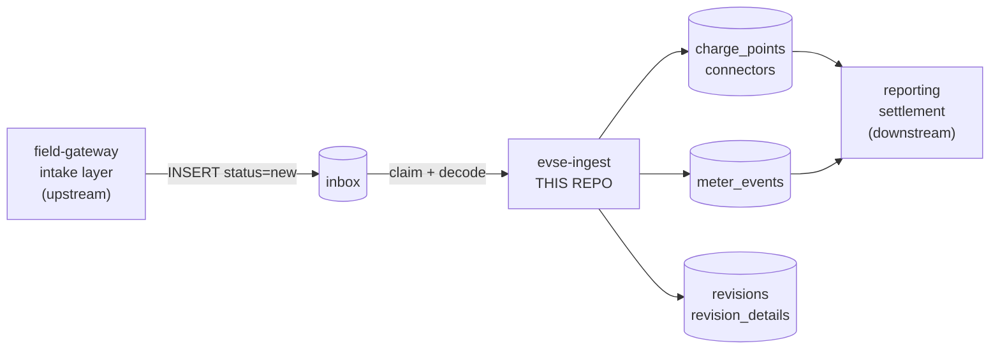

# evse-ingest Documentation

Written for someone who has never seen this codebase. Start at the top and stop when you know enough.

## Reading order

| Document | Read it when | Length |
|---|---|---|
| [Domain Overview](domain-overview.md) | You want to know what this service is *for*. Five passes, from plain-language to field-level precision, plus a glossary. | ~10 min |
| [Architecture](architecture.md) | You need the static picture: system context, containers, components, and the control flow inside the one function that does the work. | ~10 min |
| [Sequence Diagrams](sequence-diagrams.md) | You need to follow a frame through the system over time. Six zoom levels, from platform-wide to individual SQL statements. | ~15 min |
| [Data Model](data-model.md) | You are writing SQL or changing the schema. ERD, per-table reference, the `inbox.status` state machine, seed data. | ~10 min |
| [Known Issues](known-issues.md) | **Before changing anything in `src/ingest.php`.** Fifteen verified defects, with reproductions. | ~15 min |
| [Stability Spec](stability-spec.md) | **Before changing behavior.** What must remain true no matter what: 75 functional and non-functional requirements with status, and the behaviors downstream may be relying on. | ~20 min |
| [Integration Points](integration-points.md) | You are changing anything that touches the outside world, or assessing blast radius. Every SQL statement by id, the one outbound HTTP call, env vars, clocks, container coupling, cross-team contracts, risk register. | ~15 min |
| [Test suites](../tests/README.md) | You are about to change `src/`. Explains the regression gate and the refactor vs bugfix workflow. | ~10 min |

For conventions, commands, and rules when *editing* the code, see [`AGENTS.md`](../AGENTS.md) in the repository root.

## Orientation in 60 seconds

`evse-ingest` is a PHP 8.2 worker daemon. It empties a queue of EV-charger telemetry frames from a MySQL table called `inbox`, decodes each one, and writes normalized state, energy readings, and a field-level audit trail. It has no network interface — the database is the interface in both directions.



The whole service is three files:

| File | Role |
|---|---|
| `bin/worker.php` | 17 lines. The forever-loop. |
| `src/db.php` | PDO factory, a reference-counted transaction wrapper, and the stdout logger. |
| `src/ingest.php` | Everything else. `processInboxBatch()` is ~365 lines and contains all business logic. |

## The three things that will bite you

1. **`model_code == 7` is a different program.** Multi-connector hardware takes a separate path that fans one frame out into many, skips the parent-row update, and can write zero readings while reporting success. Two independent branches test for it with different conditions and they do not agree. See [Known Issues #1–#4](known-issues.md).
2. **`inbox.status` is not an enum.** In-flight frames carry a random 12-character lease token. `WHERE status IN ('new','done','bad')` silently excludes them, and a crashed worker leaves frames stranded in that state forever. See [Known Issues #5](known-issues.md).
3. **There are two test suites but no version control.** [`tests/characterization/`](../tests/characterization/) pins current behavior (defects included); [`tests/property/`](../tests/property/) explores generated inputs against invariants. There is still no unit-test framework, no CI, no linter, and no `.git`, so there is no undo. See [tests/README.md](../tests/README.md).

## Try it

```bash
docker compose up -d --build && sleep 20

# inject a frame — note the terse keys: "1" is the charge point ident
docker compose exec -T db mysql -u ingest_svc -pingest_svc evse -e "
  SET @b='{\"1\":\"CP-0001\",\"msg_type\":1,\"wh\":1234,\"la\":\"2026-09-07 12:00:00\"}';
  INSERT INTO inbox (src,status,cp_ident,body,body_hash,received_at)
  VALUES ('cp','new','CP-0001',@b,SHA1(@b),NOW());"

sleep 3
docker compose exec -T db mysql -u ingest_svc -pingest_svc evse -e "
  SELECT id,status FROM inbox ORDER BY id DESC LIMIT 3;
  SELECT id,inbox_id,cp_id,wh,utc_event_at FROM meter_events ORDER BY id DESC LIMIT 3;"

docker compose down -v
```

The reading should appear with `utc_event_at = 2026-09-07 17:00:00` — `CP-0001` is on `America/Chicago`, so 12:00 local becomes 17:00 UTC.
