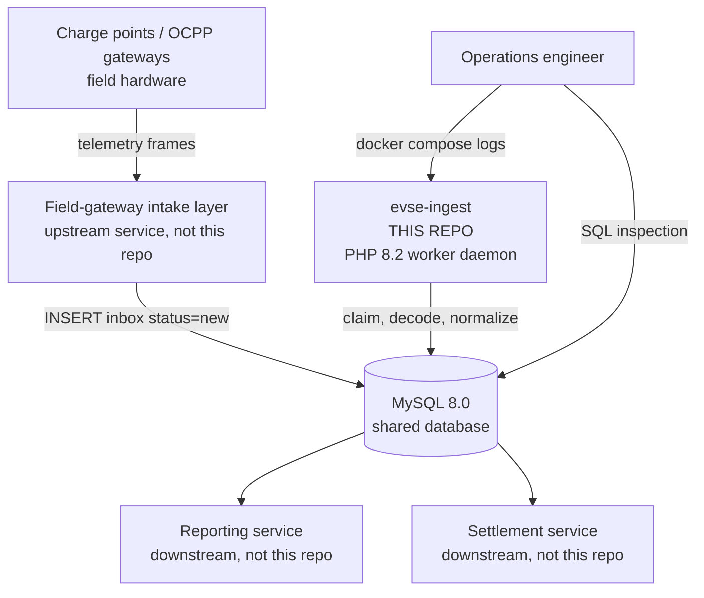
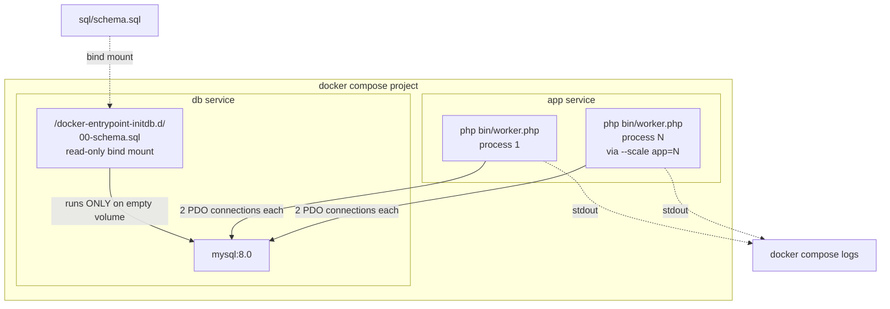
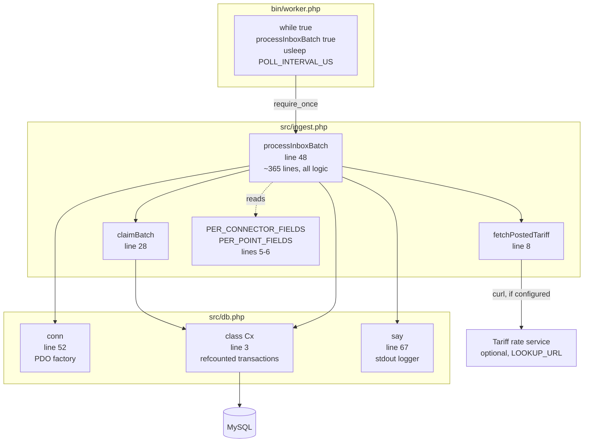
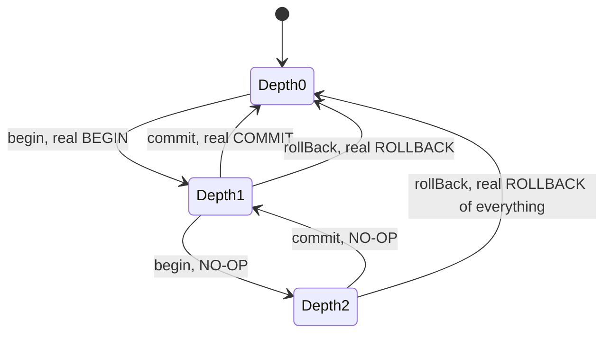
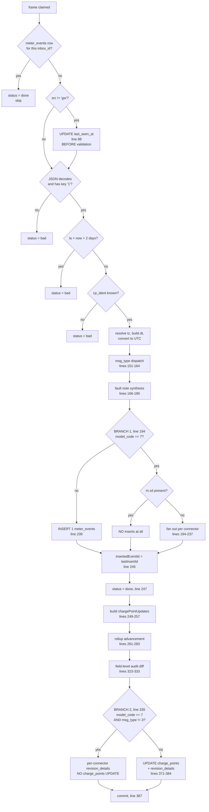
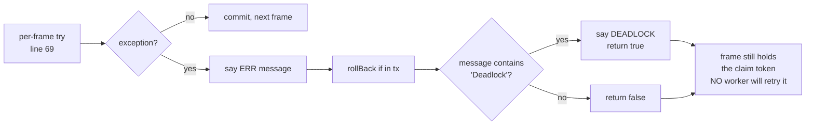

# Architecture

Four zoom levels, loosely following the C4 model: system context, containers, components, and the internal branch structure of the one function that does the work.

---

## Level 1 — System context

Who talks to what. This service has **no network interface**; every arrow crossing its boundary is a database operation.



Notes that matter:

- The intake layer and this service share the `inbox` table but never call each other. The table is the contract.
- Reporting and settlement read tables this service owns, but do not own migrations against them.
- The only observability surface is the worker's stdout and direct SQL queries. There is no metrics endpoint, no structured logging, and no health endpoint on the worker.

---

## Level 2 — Containers

What actually runs, as defined by `docker-compose.yml`.



| Container | Image | Lifecycle |
|---|---|---|
| `app` | Built from `Dockerfile`, `php:8.2-cli` + `pdo_mysql` | `restart: unless-stopped`. No healthcheck — a hung worker loop is undetectable to compose. |
| `db` | `mysql:8.0` | Healthchecked with `mysqladmin ping` every 3s, 20 retries. `app` waits on `service_healthy`. |

Two operational consequences of this topology:

1. **`Dockerfile` uses `COPY . .` and `app` has no bind-mount.** Source is baked in at build time, so code changes need `docker compose up -d --build app`. A plain `restart` runs the old code.
2. **Schema init only fires on an empty data volume.** Editing `sql/schema.sql` and restarting does nothing. Applying schema changes requires `docker compose down -v && docker compose up -d`, which destroys all data.

Each worker process opens **two** connections, not one — see Level 3.

---

## Level 3 — Components

The internals of one worker process. Three source files, no autoloader, no namespaces, no classes beyond a single PDO wrapper.



### Component responsibilities

| Component | Responsibility |
|---|---|
| `bin/worker.php` | Nothing but the loop. Reads `POLL_INTERVAL_US` once at startup, calls `processInboxBatch(true)`, sleeps unconditionally, repeats. No signal handling, no top-level try/catch, ignores the return value. |
| `claimBatch()` | Leases frames. Generates a random token, `SELECT ... FOR UPDATE SKIP LOCKED`, stamps the token into `inbox.status`, commits, re-reads by token. |
| `processInboxBatch()` | Everything else: decode, validate, dispatch, state update, fan-out, audit, status transition, error handling. One function, five-plus nesting levels. |
| `fetchPostedTariff()` | Optional HTTP lookup of the posted tariff for a coordinate. When `LOOKUP_URL` is unset it sleeps 120–210 ms and returns `null` — inside the open write transaction. |
| `Cx` | Reference-counted transaction wrapper over PDO, plus `ex()`/`q()` (byte-identical) and `lastId()`. |
| `conn()` | PDO factory. `ERRMODE_EXCEPTION`, `FETCH_ASSOC`, `EMULATE_PREPARES=false`, `utf8mb4`. |
| `say()` | The only logging facility. `[<pid>] message` to **stdout**. |

### The two-connection design

`processInboxBatch()` opens two independent `Cx` instances, `$writeConnection` and `$readConnection` (`src/ingest.php:50-51`). All mutations go through the write connection; all lookups through the read connection.

Because these are separate MySQL sessions, **reads do not see uncommitted writes from the same frame's transaction**. Anything the current frame has written is invisible to subsequent `$readConnection` queries until commit. This is load-bearing for the multi-connector path, where a lookup of a just-inserted row would fail.

### Transaction shape

`Cx` counts nesting depth rather than using savepoints:



The consequence: an inner `begin()`/`commit()` pair inside an already-open transaction does nothing at the database level, and `rollBack()` from any depth discards the entire outermost transaction. There are no partial rollbacks. The nested `begin`/`commit` around the `last_seen_at` update (`src/ingest.php:85-90`) is a logical no-op that folds into the surrounding frame transaction.

---

## Level 4 — Control flow inside `processInboxBatch()`

The single most important thing to understand before editing `src/ingest.php`: there are **two independent branches on `model_code == 7`**, at different points, with different secondary conditions. They do not agree with each other.



### Why the two branches disagree

| Frame | Branch 1 (line 194) | Branch 2 (line 335) | Net effect |
|---|---|---|---|
| `model_code != 7` | simple insert | parent UPDATE | Correct. One reading, one state update. |
| `model_code == 7`, `msg_type != 3` | fan out | connector audit only | Readings fan out; **parent row never updated**. |
| `model_code == 7`, `msg_type == 3` | fan out | **parent UPDATE** | Fan-out happens *and* the parent is updated with `last_event_id` taken from `lastInsertId()` after the fan-out loop — which is a synthetic `inbox` id, not a `meter_events` id. |
| `model_code == 7`, `m.zd` present | nothing inserted | depends on `msg_type` | Frame marked `done` having written no readings. |

The third row is a verified data-corruption path; the fourth is verified silent data loss. Both are reproduced in [Known Issues](known-issues.md).

### Error handling and the strand path



Both exit paths abandon the frame mid-flight. Its `inbox.status` is still the claiming worker's random token, which matches neither `new` nor `done` nor `bad`, so it is invisible to every future claim query. Deadlock detection is a substring match on the exception message, and changes only the return value — which `bin/worker.php` discards anyway.

Recovery is manual:

```sql
UPDATE inbox SET status = 'new' WHERE status NOT IN ('new','done','bad');
```

---

## Scaling

Horizontal scaling is safe and is the intended deployment shape: one process per allotted core.

```bash
docker compose up -d --scale app=4
```

`SKIP LOCKED` plus the per-claim token means two workers cannot take the same frame. What you lose by default is per-unit ordering: with `SHARDS=1`, two frames from one charge point may be handled concurrently by different workers and land out of order.

To preserve ordering per charge point, partition by identity — give each replica a distinct `SHARD` and a common `SHARDS`:

```
SHARD=0 SHARDS=4   # worker 0 handles CRC32(cp_ident) % 4 == 0
SHARD=1 SHARDS=4
...
```

`SHARD` and `SHARDS` are read at `src/ingest.php:31-32` and are **not documented in the root README**, nor set in `docker-compose.yml`. Note that these values are interpolated directly into the claim SQL rather than bound as parameters; the `(int)` casts are what make that safe.

---

## Related documents

- [Domain Overview](domain-overview.md) — what the service is for
- [Sequence Diagrams](sequence-diagrams.md) — the same flows over time
- [Data Model](data-model.md) — ERD and table reference
- [Known Issues](known-issues.md) — verified defects
- [Integration Points](integration-points.md) — every external touchpoint and its blast radius
- [Stability Spec](stability-spec.md) — the invariants that must survive any change
