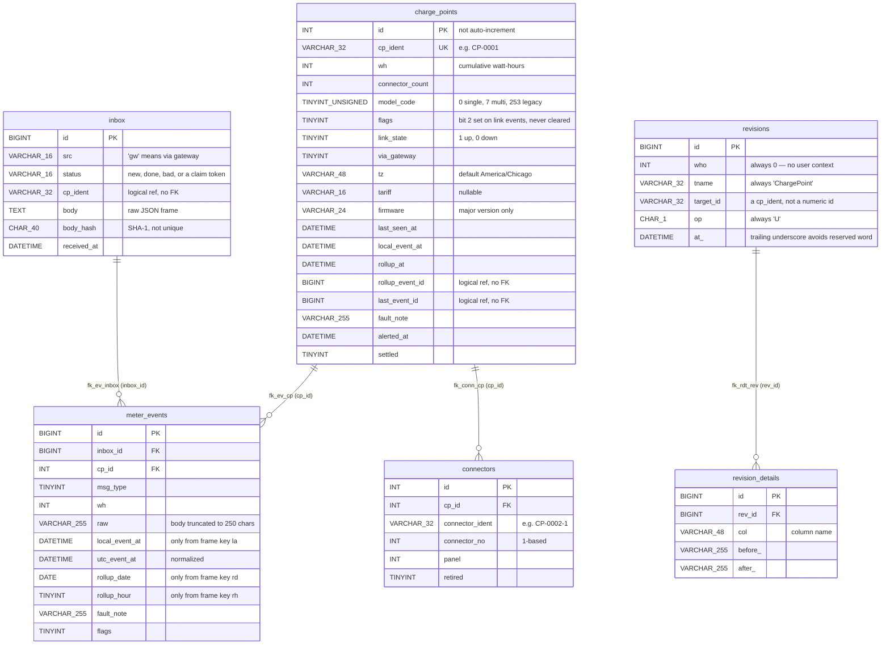
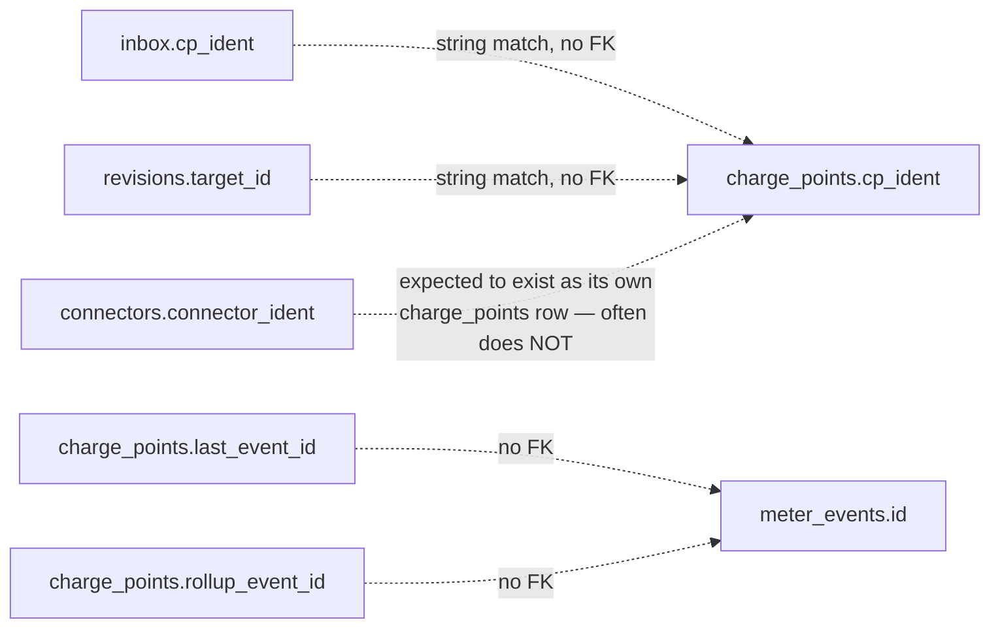
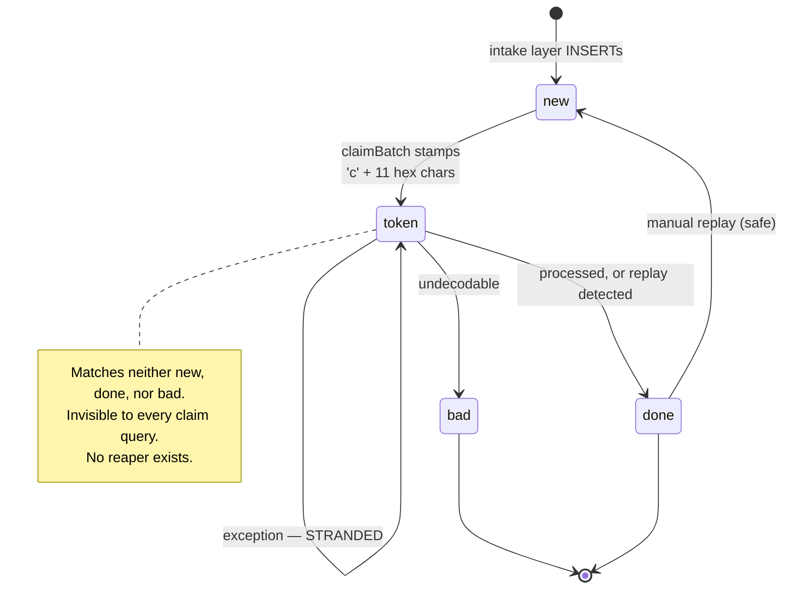

# Data Model

Six tables, defined in `sql/schema.sql`, which is the source of truth. Five are owned by this service; `inbox` is owned upstream.

---

## Entity relationship diagram — enforced constraints

Only four foreign keys actually exist in the schema. This diagram shows exactly those.



## Relationships the schema does *not* enforce

These joins are real in the code but invisible to the database. Nothing stops them from going stale or pointing at nothing.



| Logical link | Why there is no FK | Risk |
|---|---|---|
| `inbox.cp_ident` → `charge_points.cp_ident` | `inbox` is written by an upstream service that may land frames for units not yet provisioned | Unknown idents are caught in application code and the frame is marked `bad` |
| `charge_points.last_event_id` → `meter_events.id` | Would be circular with `fk_ev_cp` | **Verified to be corruptible** — the multi-connector path can write a synthetic `inbox` id here. See [Known Issues](known-issues.md) |
| `charge_points.rollup_event_id` → `meter_events.id` | Same | A dangling value silently degrades the rollup comparison |
| `revisions.target_id` → `charge_points.cp_ident` | `revisions` is polymorphic by design: `tname` + `target_id` | Cannot be enforced; `tname` is nonetheless always `'ChargePoint'` in practice |
| `connectors.connector_ident` → a `charge_points` row | Not modelled at all | **The fan-out path depends on it and the seed data violates it.** See [Known Issues](known-issues.md) |

---

## `inbox.status` — the lifecycle

`status` is `VARCHAR(16)`, **not an enum**. There is no database constraint on its contents, and at any given moment it may hold a value that appears in no documentation: a per-claim lease token.



| Value | Meaning |
|---|---|
| `new` | Awaiting processing. **The only value the worker will claim.** |
| `c…` (12 chars) | In flight, leased by one worker process |
| `done` | Terminal success — but see the caveat below |
| `bad` | Terminal rejection: undecodable, missing `1` key, timestamp >2 days future, or unknown `cp_ident` |

Two cautions when querying this column:

1. **Never assume three values.** `WHERE status IN ('new','done','bad')` silently excludes in-flight and stranded rows. To find strays: `WHERE status NOT IN ('new','done','bad')`.
2. **`done` does not imply a reading was stored.** On multi-connector hardware, `done` is reachable with zero `meter_events` rows written.

---

## Table reference

### `charge_points`

One row per physical unit. On multi-connector hardware, connector-level fields are *intended* to be folded onto this parent row.

- **`id INT PRIMARY KEY` is not `AUTO_INCREMENT`.** Every insert must supply an explicit id. Provisioning happens outside this service.
- `cp_ident` is the real join key — `inbox` and `revisions` both reference it by string, not by `id`.
- `model_code` is the branch discriminator for the entire ingest pipeline: `0` single-connector, `7` multi-connector, `253` legacy vendor build. Only `7` is special-cased; `253` follows the simple path.
- `flags` bit 2 (`| 4`) is set on any link-state frame and never cleared.
- `tz` drives all UTC conversion, defaulting to `America/Chicago` when null or empty.
- `firmware` stores a *truncated* value: `ltrim(explode('-', $fw)[0], 'v')`, so `v2-beta` is stored as `2`.
- Indexes: primary key and `UNIQUE(cp_ident)` only.

### `inbox`

Raw frames, pre-decode. **Owned by the upstream field-gateway intake layer.**

- All of `src`, `cp_ident`, `body`, `body_hash`, `received_at` are `NOT NULL` with no default. Any manual insert must supply all five.
- `body_hash CHAR(40)` is a SHA-1 of the body and is **not** unique — and the fan-out path copies the parent's hash onto rows with different bodies, so it cannot be used for deduplication.
- `KEY k_status (status, id)` exists specifically to serve the claim query's `WHERE status='new' ORDER BY id`.
- Deliberately has **no foreign keys**, because frames may arrive for units that do not exist yet.
- The worker writes to this table in three ways: status transitions, `received_at` correction on `msg_type 3` frames lacking `la`, and **inserting new synthetic rows** during multi-connector fan-out.

### `meter_events`

One decoded reading per row. The append-only output that settlement consumes.

- `raw` holds the first 250 characters of the originating frame body — truncated, so it is a diagnostic aid, not a faithful archive.
- `local_event_at` comes only from frame key `la`; `rollup_date`/`rollup_hour` come only from `rd`/`rh`. A frame supplying one style leaves the other style's columns `NULL`.
- `utc_event_at` is the normalized timestamp and the column downstream reporting should use.
- The uniqueness of `inbox_id` is what makes replay safe, but it is enforced **in application code only** — there is no unique index on `inbox_id`. Concurrent processing of the same `inbox` row would create duplicates; the claim token is what prevents that.
- Fan-out rows omit `rollup_date`, `rollup_hour`, and `fault_note` — the multi-connector insert has a shorter column list than the simple one.

### `connectors`

Per-connector identity for multi-connector hardware.

- `connector_no` is 1-based and is the index used to split the frame's colon-delimited `as` field.
- `retired = 1` excludes a connector from fan-out.
- `panel` is stored but never read by this service.
- **Implicit requirement:** the fan-out path expects a `charge_points` row whose `cp_ident` equals this table's `connector_ident`. The shipped seed data does not create those rows.

### `revisions` / `revision_details`

Field-level change audit. Header plus one detail row per changed column.

- The header is polymorphic in design (`tname` + `target_id`), which is why no FK is possible. In practice every row written by this service is `who = 0`, `tname = 'ChargePoint'`, `op = 'U'`.
- `target_id` holds a `cp_ident` string — for fan-out, a `connector_ident`.
- `at_`, `before_`, `after_` carry trailing underscores to dodge SQL reserved words. Keep the convention if you add columns.
- `before_`/`after_` are `VARCHAR(255)`, so all values are stringified and long values are truncated.
- Details are accumulated in memory and flushed at the end of the frame; any detail still holding a `NULL` `rev_id` at flush time is **silently discarded**.
- `KEY k_t (tname, target_id)` supports "show me the history of this unit".

---

## Seed data

`sql/schema.sql` ends with fixture rows. This is what a fresh `docker compose up` gives you.

| `id` | `cp_ident` | `model_code` | `connector_count` | `tz` | Exercises |
|---|---|---|---|---|---|
| 1 | `CP-0001` | 0 | 1 | `America/Chicago` | the simple path |
| 2 | `CP-0002` | **7** | 3 | `America/Chicago` | multi-connector fan-out |
| 3 | `CP-0003` | 0 | 1 | **`America/Denver`** | non-default timezone conversion |
| 4 | `CP-0004` | 253 | 2 | `America/Chicago` | legacy model code, still the simple path |
| 10–21 | `CP-0010`…`CP-0021` | 0 | 1 | `America/Chicago` | bulk fleet, generated by a cross-join |

Note the id gap: **ids 5–9 do not exist.** The bulk generator starts at 10.

`connectors` is seeded with three rows, all under `cp_id = 2`: `CP-0002-1` (no 1, panel 0), `CP-0002-2` (no 2, panel 0), `CP-0002-3` (no 3, panel 1).

There are **no** `charge_points` rows for `CP-0002-1`, `CP-0002-2`, or `CP-0002-3`, which is why the fan-out path writes no readings on stock seed data.

---

## Working with the schema

`sql/schema.sql` is mounted read-only into the MySQL container's `/docker-entrypoint-initdb.d/`. That directory is only executed **when the data volume is empty**, so:

```bash
# editing sql/schema.sql then restarting does NOTHING
docker compose down -v && docker compose up -d     # required to apply schema changes
```

The script itself is re-runnable by design — it opens with `SET FOREIGN_KEY_CHECKS = 0`, drops all six tables in dependency order, then recreates them. Running it against a live database destroys all data.

There is no migration tooling. The file is the only schema artifact, and changes to it must be coordinated with the downstream reporting and settlement services, which read these tables but do not own migrations against them.

---

## Related documents

- [Domain Overview](domain-overview.md) — what these tables represent
- [Sequence Diagrams](sequence-diagrams.md) — the write patterns against them
- [Architecture](architecture.md) — transaction and connection model
- [Known Issues](known-issues.md) — where the model and the code disagree
- [Integration Points](integration-points.md) — every external touchpoint and its blast radius
- [Stability Spec](stability-spec.md) — the invariants that must survive any change
