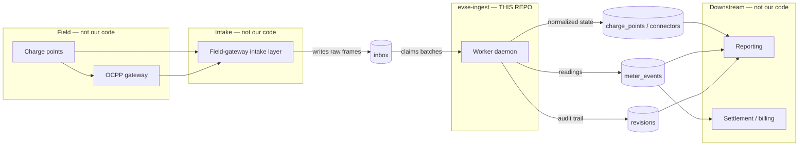

# Domain Overview

This document explains what `evse-ingest` is for, in five passes. Each pass assumes you read the previous one and adds precision. Read as far as you need and stop.

---

## Level 0 — One paragraph, no jargon

Electric-vehicle chargers in car parks and depots report on themselves: how much electricity they've delivered, whether they're online, whether something is broken. Those reports arrive as small messages and pile up in a queue. This program is the thing that empties the queue. It reads each message, works out what it means, and files the result into tidy tables that billing and reporting teams can query. It runs forever in the background, in small batches, and it keeps a record of every change it makes.

---

## Level 1 — The physical world, and the words we use

A **site** (a car park, a depot) has one or more **charge points**. A charge point is a physical box bolted to the ground. Some boxes have a single socket; others have several, and each socket is a **connector**.

A charge point reports **telemetry** — a stream of small status messages. Each message is a **frame**. Some frames say "here is my meter reading"; others say "I just came online", "I just went offline", or "I'm overheating".

Frames reach the platform in one of two ways. Either the charge point talks to us directly, or it talks through a **gateway** — a piece of middleware that speaks the charger's native protocol (commonly **OCPP**, the industry standard for charger-to-backend communication) and forwards the result on. The `inbox.src` column records which route a frame took; the literal value `gw` means it came via a gateway.

### Glossary

| Term | Meaning |
|---|---|
| EVSE | Electric Vehicle Supply Equipment — the formal name for a charge point |
| Charge point | One physical unit. Row in `charge_points`. Identified by `cp_ident`, e.g. `CP-0001` |
| Connector | One socket on a multi-socket unit. Row in `connectors`, e.g. `CP-0002-1` |
| Frame | One raw telemetry message. Row in `inbox` |
| Gateway | Protocol-translating middleware. `inbox.src = 'gw'` |
| Wh | Watt-hours. The energy unit used throughout; `charge_points.wh` and `meter_events.wh` |
| Tariff | The price band in force at the charger's location |
| Rollup | A pre-computed time bucket (date + hour) attached to a reading so reporting doesn't have to group by timestamp |
| Revision | One audited change to one row, with before/after values per field |
| Link state | Whether the unit is currently reachable. `1` = up, `0` = down |

---

## Level 2 — Where this service sits in the data plane

The platform is a pipeline. This service occupies exactly one stage of it: the **normalization** stage between raw intake and analytical consumption.

The critical thing to understand is **ownership**, because it dictates what you are allowed to change:

| Boundary | Who owns it | Consequence for you |
|---|---|---|
| `inbox` table | The field-gateway intake layer, upstream | This service only *reads* frames and *updates their status*. Do not add foreign keys to `inbox`; coordinate any column change with that team. |
| `charge_points`, `connectors`, `meter_events`, `revisions`, `revision_details` | **This service** | `sql/schema.sql` is the source of truth. You may change these. |
| Reads of the above | Reporting and settlement services | They do not own migrations against this schema, so a change you make here can silently break their queries. Coordinate separately. |

There is no message broker, no HTTP API, and no service mesh involved. The database *is* the interface, in both directions. This service exposes no network listener at all.

---

## Level 3 — The precise contract

### What the service consumes

A row in `inbox` with `status = 'new'`. Nothing else is picked up — a frame written with any other status is invisible to the worker forever.

### What the service guarantees

1. **Every claimed frame reaches a terminal status** — `done` or `bad` — *provided processing does not throw*. See the non-guarantees below.
2. **At-most-once event creation.** Before processing, the worker checks whether a `meter_events` row already exists for this `inbox.id`. If one does, the frame is marked `done` without writing a duplicate. Replaying a frame by resetting its status to `new` is therefore safe.
3. **Every field change is audited.** A `revisions` header plus one `revision_details` row per changed field, recording `before_` and `after_`.
4. **Timestamps are normalized to UTC** in `meter_events.utc_event_at`, converted from the charge point's own timezone (`charge_points.tz`, defaulting to `America/Chicago`).
5. **Concurrency is safe.** Multiple worker processes can run against one database. Claiming uses `SELECT ... FOR UPDATE SKIP LOCKED` followed by a status token unique to the claiming process, so two workers cannot take the same frame.

### What the service explicitly does *not* guarantee

These are real, verified behaviors, not hypotheticals. They matter more than the guarantees.

1. **Frames are not guaranteed to be retried.** If processing throws anything other than a deadlock, the frame keeps the claiming worker's private status token and no worker will ever look at it again. There is no reaper, no timeout, no dead-letter queue.
2. **`done` does not mean "a reading was recorded".** On multi-connector hardware a frame can be marked `done` while writing zero `meter_events` rows, silently and without a log line. See [Known Issues](known-issues.md).
3. **Ordering is not guaranteed** unless you shard. With several workers and `SHARDS=1`, two frames from the same charge point may be processed out of order. Setting `SHARD`/`SHARDS` partitions work by `CRC32(cp_ident)` so one worker owns a given unit.
4. **Liveness is not tied to validity.** A frame that fails to decode still updates `charge_points.last_seen_at` — but only when `src` is not `gw`. The "I heard from this unit" write happens *before* validation.

---

## Level 4 — Frame semantics, field by field

A frame body is a JSON object. Keys are terse and positional-feeling; there is no schema version field.

| Key | Meaning | Effect |
|---|---|---|
| `1` | Charge point identifier, matched against `charge_points.cp_ident` | **Required.** Missing → frame marked `bad`. Unknown value → `bad`. |
| `msg_type` | Numeric message discriminator | Drives dispatch, see below. Stored on `meter_events.msg_type`. |
| `wh` | Meter reading in watt-hours | Written to `meter_events.wh`; propagated to `charge_points.wh`. |
| `la` | Local event timestamp, charger's own wall clock | Source for `meter_events.local_event_at`; converted to UTC. More than 2 days in the future → `bad`. |
| `rd` / `rh` | Rollup date / rollup hour | Alternative time source; written to `meter_events.rollup_date` / `rollup_hour`. |
| `nt` | Fault note text | Scanned for `OVERHEAT`, `GROUND FAULT`, `CONNECTOR LOCK FAULT`. |
| `fl` | Fault flag; `'1'` = fault active | Stored in `meter_events.flags`. Gates diagnostic synthesis. |
| `sv` / `hv` | Software / hardware version | Threshold check gating diagnostic synthesis. |
| `dbg` | Diagnostic blob | Scanned for markers `;A1;` → ground fault, `;B1;` → connector lock fault, `;C1;` → under voltage. |
| `as` | Colon-delimited per-connector meter readings, e.g. `"100:200:300"` | Multi-connector hardware only; index is `connector_no - 1`. |
| `md` | Reported model code | Overwrites `charge_points.model_code`. |
| `rt` | Reported tariff | Overwrites `charge_points.tariff`. |
| `connector_count` | Reported socket count | Overwrites `charge_points.connector_count`. |
| `nl` | Unknown purpose | Discarded on link-state frames. |
| `m` | Metadata sub-object | Unpacked then removed, see below. |

The `m` sub-object carries:

| Key | Meaning |
|---|---|
| `m.firmware` | Reported firmware string. Truncated to a major version before storage: `v2-beta` → `2`. |
| `m.zd` | Connector descriptor. **Its mere presence suppresses multi-connector fan-out entirely.** |
| `m.la` / `m.lo` | Latitude / longitude, used only for the tariff lookup |
| `m.sw` | Settlement-requested flag; sets `charge_points.settled` |

### `msg_type` dispatch

| Value | Meaning | Behavior |
|---|---|---|
| `3` | Heartbeat / status | If `la` is absent, rewrites `inbox.received_at` to site-local now. On multi-connector units this is the *only* value that lets the parent row be updated. |
| `9` | Connect | `link_state = 1`, `flags |= 4` |
| `11` | Reconnect | `link_state = 1`, `flags |= 4` |
| `14` | Disconnect | `link_state = 0`, `flags |= 4` |
| `17` | Overheat alert | Sets the internal overheat flag |
| anything else | Ordinary telemetry | Written straight to `meter_events` |

`flags |= 4` is never cleared, so bit 2 accumulates permanently once a unit has ever reported a link-state change.

### The two hardware classes

Everything hinges on `charge_points.model_code`:

- **`model_code != 7`** (values `0` single-connector, `253` legacy vendor build) — the simple path. One frame produces one `meter_events` row and one `UPDATE charge_points`.
- **`model_code == 7`** — multi-connector. One frame *fans out* into N synthetic `inbox` rows and N `meter_events` rows, one per non-retired connector, and the parent `charge_points` row is **not** updated unless `msg_type == 3`. This path is where the known defects live; read [Known Issues](known-issues.md) before touching it.

---

## Where to go next

- [Architecture](architecture.md) — system, container, and component views
- [Sequence Diagrams](sequence-diagrams.md) — the dataflows at four zoom levels
- [Data Model](data-model.md) — ERD and per-table reference
- [Known Issues](known-issues.md) — verified defects, with reproductions
- [Integration Points](integration-points.md) — every external touchpoint and its blast radius
- [Stability Spec](stability-spec.md) — the invariants that must survive any change
