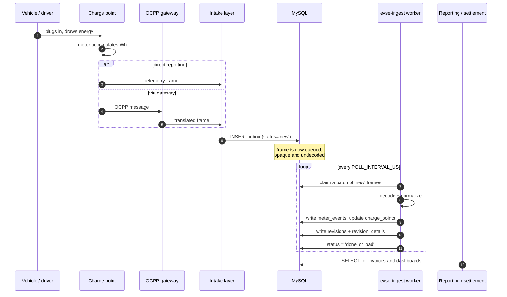
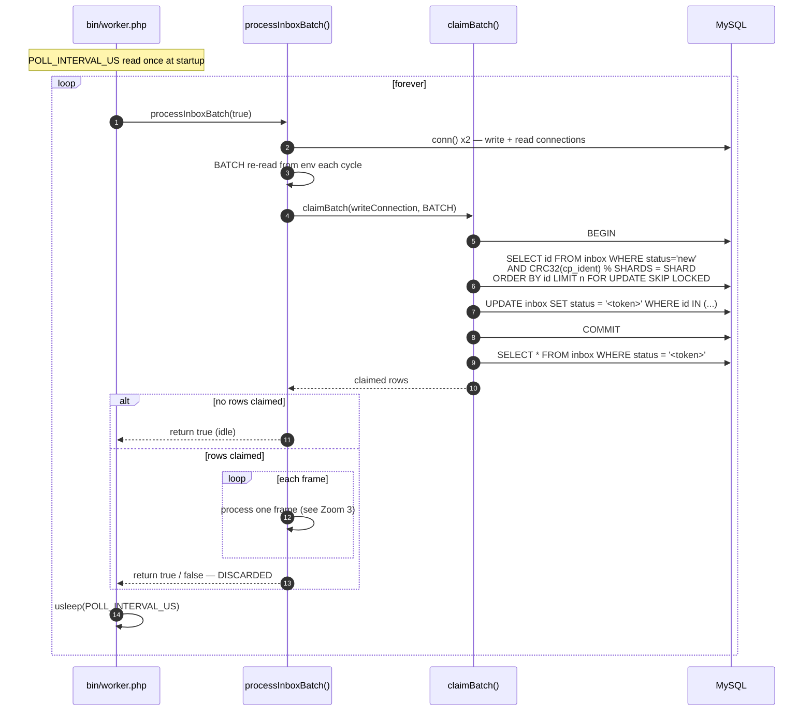
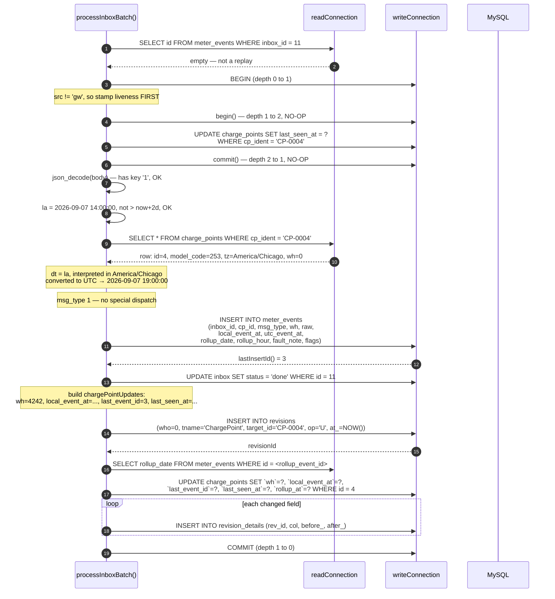
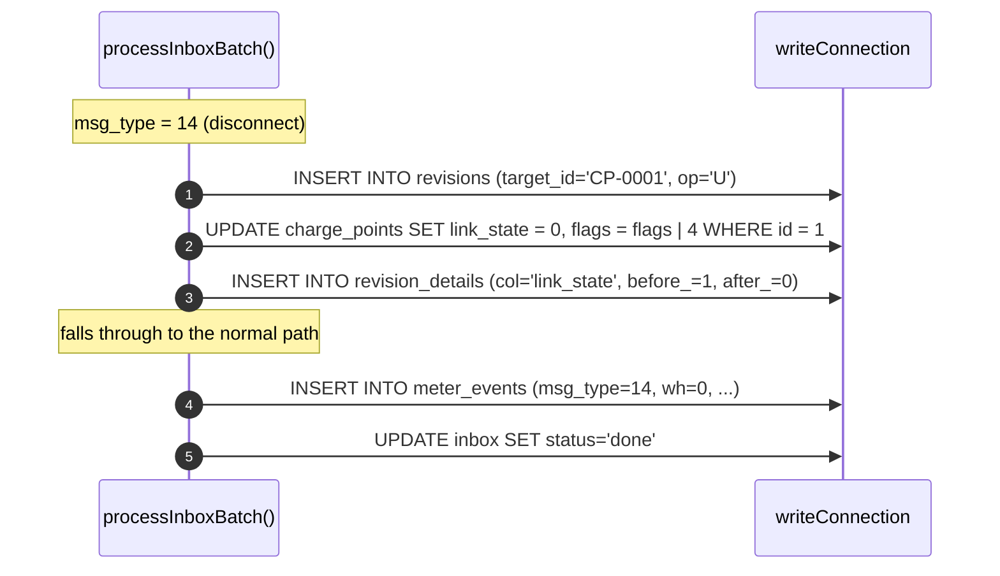
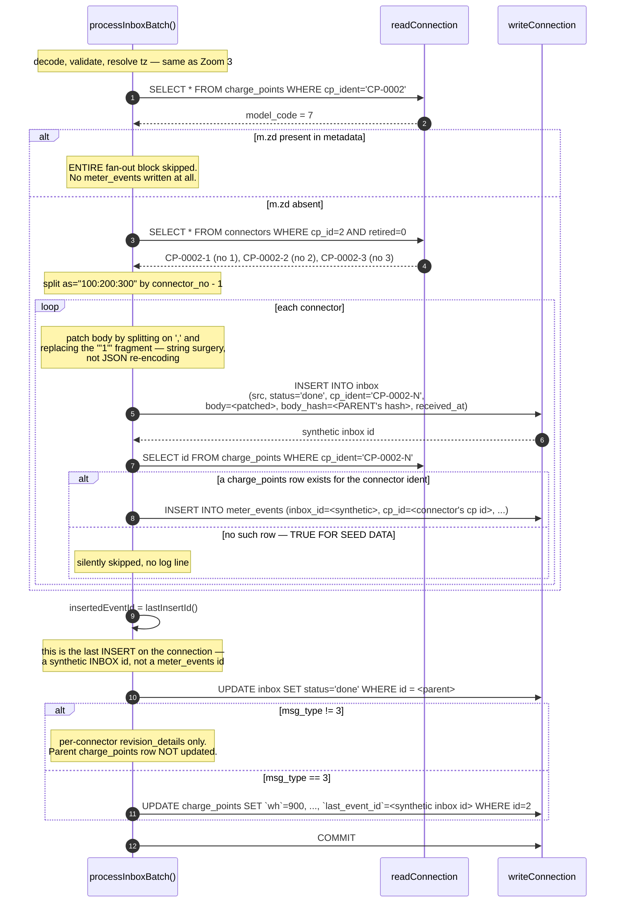
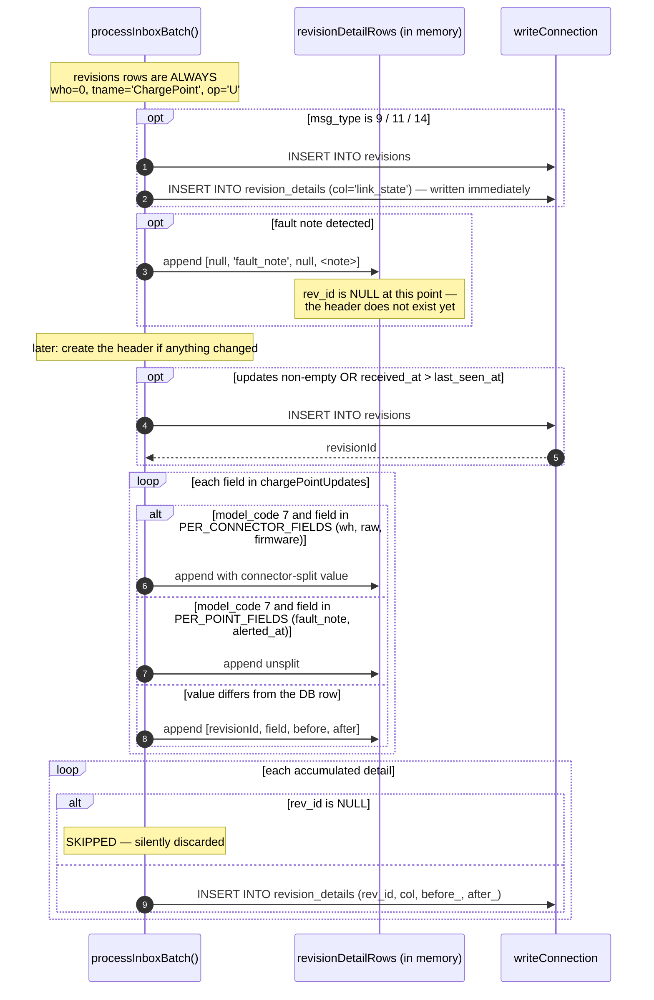
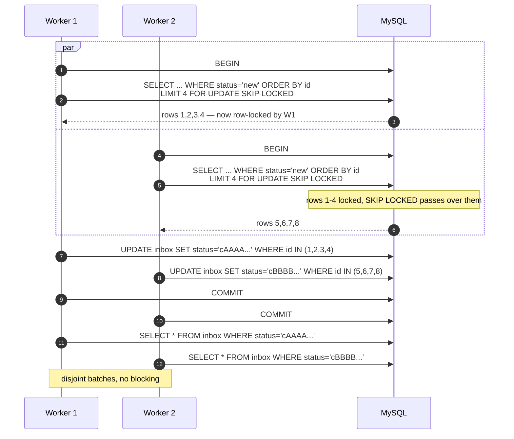
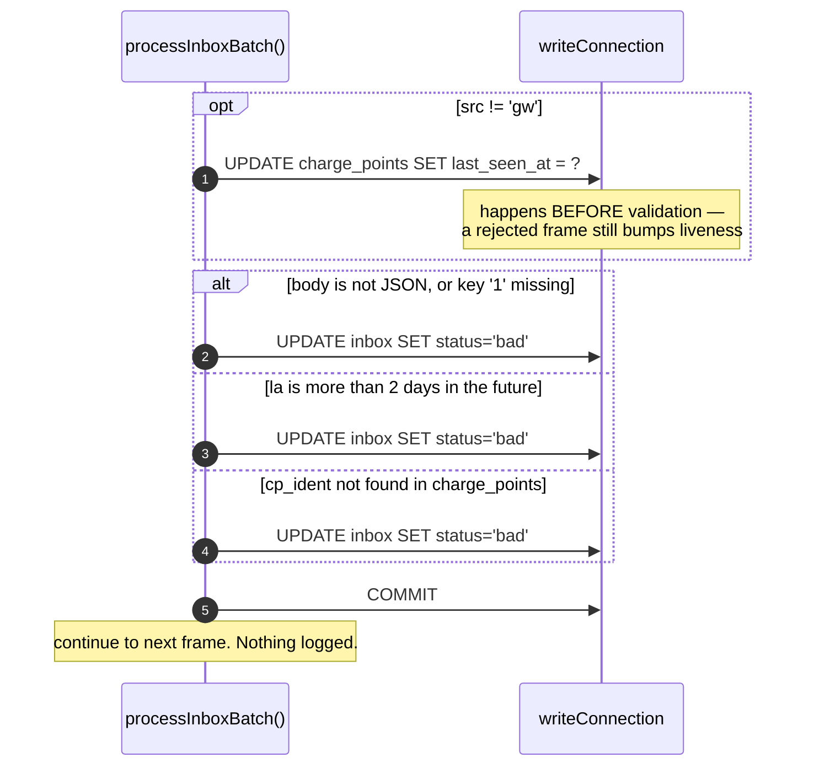
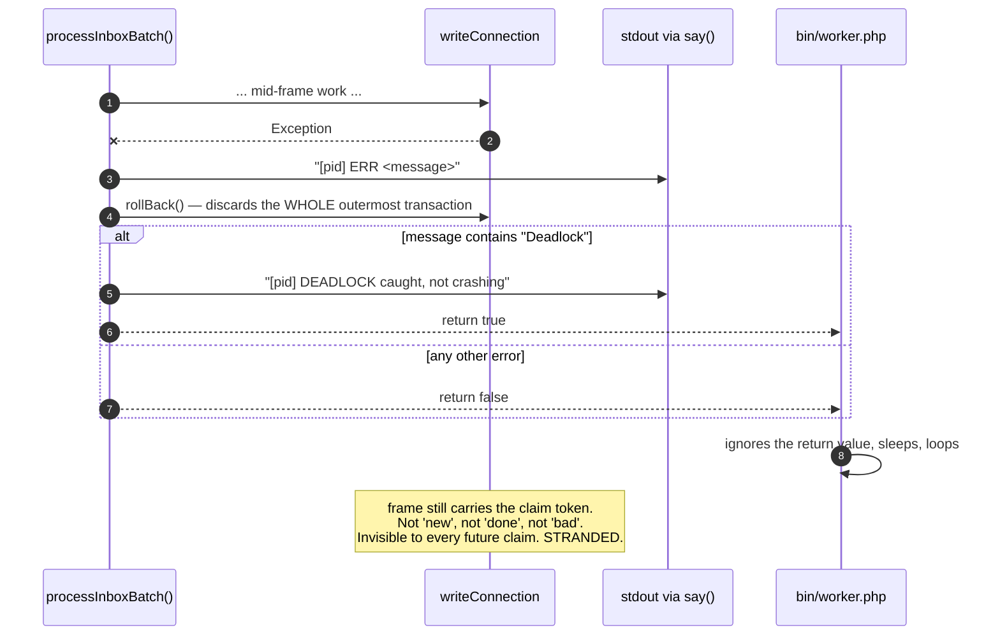
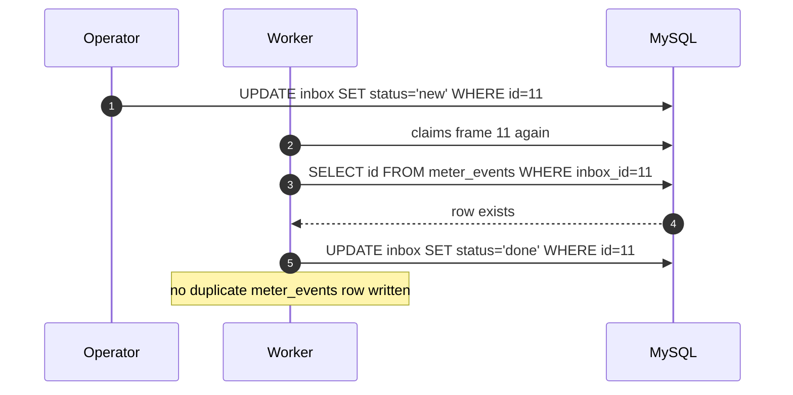

# Sequence Diagrams

Six views of the same system, from platform-wide down to individual SQL statements. Every diagram below was checked against a running stack; the concrete values in the walkthroughs are real observed output, not illustrations.

| Zoom | Diagram | Answers |
|---|---|---|
| 1 | [Platform lifecycle](#zoom-1--platform-lifecycle) | How does a physical event become a billable number? |
| 2 | [One worker cycle](#zoom-2--one-worker-cycle) | What does the daemon do every 250 ms? |
| 3 | [One frame, simple hardware](#zoom-3--one-frame-single-connector-hardware) | What happens to a normal frame? |
| 4 | [One frame, multi-connector](#zoom-4--one-frame-multi-connector-hardware-model_code--7) | Why is the multi-connector path dangerous? |
| 5 | [Audit trail construction](#zoom-5--audit-trail-construction) | How are `revisions` rows built? |
| 6 | [Concurrency and failure](#zoom-6--concurrency-and-failure-paths) | What happens with N workers, or when things break? |

---

## Zoom 1 — Platform lifecycle

The whole journey, with this repo as a single box.



The handoff at step 5 is the only contract between the intake layer and this service. Everything before it belongs to another team; everything after step 6 belongs to this repo.

---

## Zoom 2 — One worker cycle

`bin/worker.php` is a bare loop. It never inspects the result of the call it makes.



Three things to notice:

- **The claim is its own committed transaction.** The lease is durable before any decoding starts, which is what makes `SKIP LOCKED` sufficient for multi-process safety.
- **The token is the lease.** It is `'c'` plus 11 hex characters, unique per `claimBatch()` call. A frame carrying a token is invisible to every other worker's claim query, because the query filters `status = 'new'`.
- **The sleep is unconditional.** Even after processing a full batch, the worker sleeps. Throughput is capped at roughly `BATCH / POLL_INTERVAL_US` frames per second per process — with defaults, about 16 frames/sec.

---

## Zoom 3 — One frame, single-connector hardware

The happy path, `model_code != 7`. This walkthrough is a real observed run.

**Input:** `{"1":"CP-0004","msg_type":1,"wh":4242,"la":"2026-09-07 14:00:00"}`, `src='cp'`, `CP-0004` has `model_code = 253`, `tz = America/Chicago`.



**Observed result:** `inbox.status='done'`; one `meter_events` row `(id=3, inbox_id=11, cp_id=4, wh=4242)`; `charge_points.last_event_id=3` correctly pointing at that row; `revision_details` recording `wh: 0 → 4242`.

### Timezone conversion, verified twice

| Unit | `tz` | Frame time source | Stored `utc_event_at` |
|---|---|---|---|
| `CP-0001` | `America/Chicago` | `la = 12:00:00` | `17:00:00` (CDT, UTC−5) |
| `CP-0003` | `America/Denver` | `rd=2026-09-06`, `rh=14` | `2026-09-06 20:00:00` (MDT, UTC−6) |

Two asymmetries fall out of this, both verified:

- `meter_events.local_event_at` is populated **only** from `la`. A frame using `rd`/`rh` stores `NULL` there.
- `charge_points.rollup_at` only advances when `la` is present, because the guard requires `local_event_at` to be in the update set. An `rd`/`rh` frame leaves `rollup_at` untouched — observed as `NULL` on `CP-0003` after a successful rollup frame.

### Link-state frames also write readings

`msg_type` 9, 11, and 14 are not pure control messages. On single-connector hardware they take the same path and insert a `meter_events` row with `wh` defaulting to `0`:



Observed: `link_state` moved `0 → 1` on `msg_type 9` and `1 → 0` on `msg_type 14`; `flags` became `4` and **stayed** `4` — the bit is never cleared.

---

## Zoom 4 — One frame, multi-connector hardware (`model_code = 7`)

This is the path to be careful with. Observed run: `{"1":"CP-0002","msg_type":3,"wh":900,"as":"100:200:300","la":"2026-09-07 12:00:00"}` against `CP-0002`, which has three connectors `CP-0002-1..3`.



**Observed result for the `msg_type = 3` run above:**

| Table | Observed |
|---|---|
| `inbox` | 4 rows: parent `CP-0002` plus synthetic `CP-0002-1`, `CP-0002-2`, `CP-0002-3`, **all `done`, all sharing one `body_hash`** |
| `meter_events` | **0 rows** |
| `charge_points` id 2 | `wh=900`, `last_event_id=4` — and `4` is a synthetic **`inbox`** id, while `meter_events` is empty |

So a frame that recorded no energy reading whatsoever was acknowledged as `done`, and the parent row now carries a `last_event_id` pointing into the wrong table. `charge_points.last_event_id` has no foreign key, so nothing catches it.

With `msg_type != 3` the same frame leaves the parent row entirely untouched — a frame carrying `wh: 777` was observed to leave `charge_points.wh` at its previous value.

Full reproductions are in [Known Issues](known-issues.md).

---

## Zoom 5 — Audit trail construction

Every field change is meant to produce a `revisions` header plus one `revision_details` row per field. Details are accumulated in memory throughout processing and flushed at the end.



Two consequences worth internalizing:

- **A detail queued before its header exists is dropped.** Rows appended with a `NULL` `rev_id` — the fault-note case above — are filtered out at flush time. The audit trail can therefore be incomplete without any error.
- **Details are only written for fields whose value actually changed**, compared against the row read at the start of processing.

Observed audit output for a clean single-connector run:

```
target_id  op  col             before_              after_
CP-0003    U   wh              0                    5000
CP-0003    U   last_event_id   NULL                 4
CP-0003    U   last_seen_at    2026-09-07 21:46:59  2026-09-07 21:47:38
```

---

## Zoom 6 — Concurrency and failure paths

### Two workers racing for the same batch



Neither worker waits on the other: `SKIP LOCKED` turns contention into partitioning. The re-read by token is what lets each worker recover exactly its own set.

### Frame rejection — the three `bad` paths

All three were reproduced.



Observed: a garbage frame for `CP-0010` with `src='cp'` moved `last_seen_at` from `NULL` to a real timestamp and *then* was marked `bad`. The identical frame for `CP-0011` with `src='gw'` left `last_seen_at` as `NULL`. Rejections produce no log output at all.

### Exception — the strand path



The rollback undoes the `bad`/`done` status write along with everything else, because `Cx` has no savepoints. The frame is now unreachable. Find and recover stranded frames with:

```sql
SELECT id, cp_ident, status, received_at
FROM inbox WHERE status NOT IN ('new','done','bad');

UPDATE inbox SET status='new' WHERE status NOT IN ('new','done','bad');
```

### Replay is safe



Verified: after resetting a processed frame to `new`, it returned to `done` and `meter_events` was unchanged. This makes the strand-recovery `UPDATE` above safe to run even if some of those frames had partially succeeded.

---

## Related documents

- [Domain Overview](domain-overview.md) — vocabulary and platform context
- [Architecture](architecture.md) — static structure behind these flows
- [Data Model](data-model.md) — the tables being written
- [Known Issues](known-issues.md) — reproductions of the defects noted above
- [Integration Points](integration-points.md) — every external touchpoint and its blast radius
- [Stability Spec](stability-spec.md) — the invariants that must survive any change
