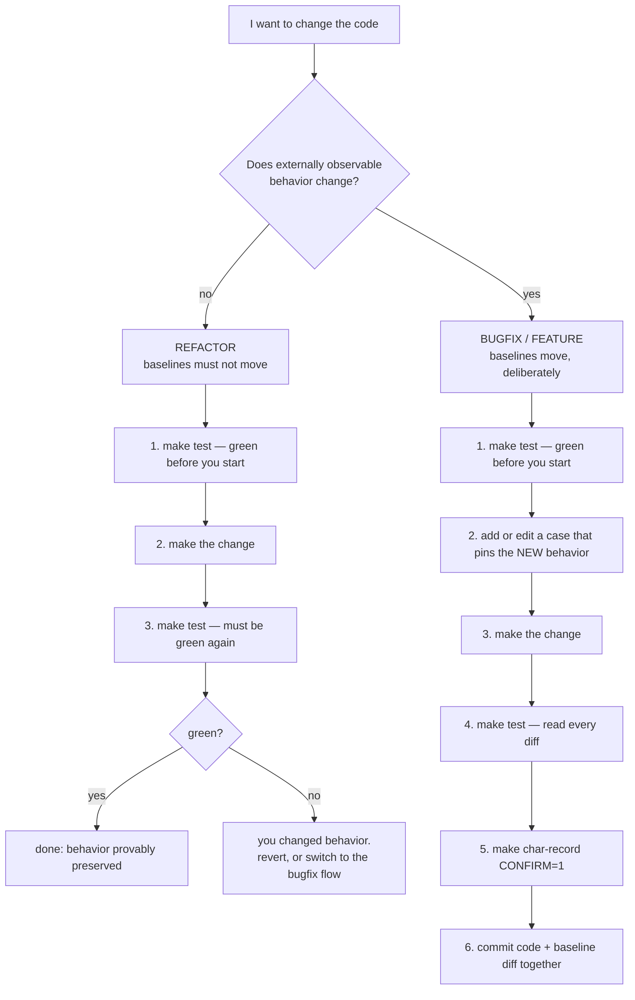

# Tests

This repository has two test suites, and both are regression gates:

| Suite | Pins | When it runs |
|---|---|---|
| [`characterization/`](characterization/) | 26 **known** inputs, asserted byte-for-byte against recorded baselines | every change |
| [`property/`](property/) | **generated** inputs, checked against invariants and narrow oracles | every change; longer runs before risky work |

They are complementary. Characterization catches *any* change to a known
scenario but only sees scenarios someone wrote down. Property testing explores
inputs nobody wrote down but can only check properties, not exact output. The
two defects recorded as known issues 14 and 15 were found by the property suite
and then promoted into characterization cases 25 and 26 — that is the intended
pipeline between them.

Neither is a unit-test suite.

Neither asserts that the service is *correct*. They assert that it behaves
**exactly as it behaves today**, including the defects catalogued in
[`docs/known-issues.md`](../docs/known-issues.md). That is the point. Several of those defects are load-bearing for downstream consumers,
so changing them silently is worse than leaving them in place.

Read this file before you run the suite, and especially before you re-record a
baseline.

---

## What the suite guarantees

The suite drives the real service, built from the real `Dockerfile`, against a
disposable MySQL container seeded from the real `sql/schema.sql`. It observes
**only external edges**:

| Edge | How it is observed |
|---|---|
| Database | SQL against every table, plus a computed diff against the pristine seed |
| Outbound HTTP | A recording mock captures every request; paths are asserted verbatim |
| Log / stdout | Container logs, with the pid prefix normalised |
| File writes | `docker diff` on the service container |
| Process state | Container state after the batch settles |

It never imports, parses, or references application source. It does not know or
care what language the service is written in. Every assertion is evaluated
**after the batch has quiesced** — that is, at the end of a unit of processing,
never mid-flight.

---

## Command reference

Everything is wrapped by the root [`Makefile`](../Makefile); `make` with no
arguments lists all targets.

| Command | Does |
|---|---|
| `make test` | Both suites. The regression gate |
| `make verify` | `lint` + `docs-check` + both suites. Pre-merge |
| `make test-char` | Characterization only (~6 min) |
| `make test-prop` | Property only (~10 min) |
| `make test-char CASES='09-*'` | One case or a glob |
| `make test-prop SCENARIOS=100 SEED=42` | Longer or reproducible property run |
| `make char-list` | List cases with descriptions |
| `make char-record CONFIRM=1` | Re-record baselines. **Behavior change only** |
| `make prop-replay FILE=corpus/x.json` | Replay a saved counterexample |
| `make smoke` | One frame end-to-end against the production compose stack |
| `make clean` | Tear down every stack and delete transient artefacts |

## Running it

```bash
make test-char                      # verify every case against its baseline (~6 min)
make char-list                      # list cases with descriptions
make test-char CASES='09-*'         # verify a subset
make char-record CONFIRM=1          # re-record — see the rules below
```

`make char-record` refuses without `CONFIRM=1`, on purpose: recording during a
refactor is how an unreviewed behavior change gets committed. The runner is
still available directly when you need a flag the Makefile does not wrap:

```bash
cd tests/characterization
./run.py --keep-up '20-*'           # leave the stack up for poking around
```

Requirements: `docker` (with compose v2), `make`, and `python3`. No PHP is
needed on the host — not even to lint, which runs in the container via
`make lint`. Both suites are Python and share
[`harness/stack.py`](harness/stack.py), so there is nothing to install and no
GNU-vs-BSD shell-tool divergence between Linux and macOS.

A full run takes roughly five to six minutes: each case stops the worker, resets
the database, restarts the worker, and waits for the batch to settle.

Exit status is `0` only when every baseline matches byte-for-byte **and** every
declared assertion holds.

---

## The two workflows

Everything below hinges on one question: **are you changing observable behavior?**



### Workflow A — Refactoring (no behavior change)

Restructuring, renaming, extracting functions, adding types, splitting the
365-line `processInboxBatch()`. The contract is: **not one byte of any baseline
may move.**

1. **Establish the baseline is green first.**
   ```bash
   make test
   ```
   If it is already red, stop. Fix or record that separately, so your refactor
   is not entangled with a pre-existing difference.

2. **Refactor.**

3. **Re-run.**
   ```bash
   make test
   ```

4. **Green means done.** Behavior is provably preserved across every edge the
   suite watches.

5. **Red means you changed behavior**, whether or not you meant to. Read
   `tests/characterization/.results/<case>.diff`. Then either revert the
   offending part, or — if the change is genuinely desirable — stop and switch
   to Workflow B, because you are no longer refactoring.

**Never run `make char-record` during a refactor.** Recording is how a refactor
quietly becomes an unreviewed behavior change. The `CONFIRM=1` guard exists to
make that pause deliberate: if you find yourself reaching for it, that is the
signal this is a bugfix, not a refactor.

### Workflow B — Bugfixes and features (behavior changes on purpose)

Fixing any entry in [`docs/known-issues.md`](../docs/known-issues.md), or adding
a feature. Here baselines *must* move, and the diff is the deliverable.

1. **Establish the baseline is green first**, exactly as above.

2. **Pin the intended new behavior before touching the code.** Add a case, or
   edit the assertions of an existing one, so the suite fails for the right
   reason. This is a red-first step and it is where the actual design decision
   gets recorded.

   For example, fixing known issue 1 (multi-connector frames writing no
   readings) means editing
   `cases/09-multiconnector-fanout-writes-no-readings.json` so its `assert.sql`
   demands three `meter_events` rows instead of zero, and renaming the case to
   describe the fixed behavior.

3. **Make the change.**

4. **Run and read every diff.**
   ```bash
   make test
   cat tests/characterization/.results/*.diff
   ```
   Interrogate each one:
   - Is every moved line a line you intended to move?
   - Did an unrelated case drift? A fix to the fan-out path that also perturbs
     `charge_points` for single-connector units is a bug in the fix.
   - Did a row *disappear* that a downstream consumer might be reading?

   This is the step people skip. Do not skip it. A characterization diff is the
   most precise change description you will ever get for this service.

5. **Re-record.**
   ```bash
   make char-record CONFIRM=1
   ```

6. **Commit the code change and the baseline diff in the same commit**, with a
   message that explains the behavior change. The baseline diff *is* the
   changelog: reviewers read it to see exactly what the service now does
   differently.

7. **Update the prose.** A behavior change invalidates documentation:
   - move the entry out of `docs/known-issues.md` (or mark it fixed)
   - update the matching gotcha in [`AGENTS.md`](../AGENTS.md)
   - update the relevant diagram in `docs/sequence-diagrams.md`
   - if you changed an edge, update `docs/integration-points.md`

8. **Tell the affected teams.** `docs/integration-points.md` names them: the
   field-gateway intake layer owns `inbox`, and reporting and settlement read
   the tables this service writes without owning migrations against them. Fixing
   a defect they have silently adapted to is a breaking change for them.

---

## Deciding which workflow applies

Use the suite itself as the arbiter. Make the change, run `make test`, and let
the result classify it:

| Result | What it means |
|---|---|
| Green | It was a refactor. Nothing observable moved. |
| Red | It was a behavior change. Either revert it or own it via Workflow B. |

The one thing you must not do is see red and reach for `char-record` without
reading the diff.

---

## Running the property suite

```bash
make test-prop                              # 30 generated scenarios (~10 min)
make test-prop SCENARIOS=100                # before risky work
make test-prop SEED=20260907                # reproduce a run exactly
make prop-replay FILE=corpus/x.json         # re-run a saved counterexample
```

`make prop-replay` with no `FILE` lists the saved counterexamples.

Requirements: `docker` and `python3` (stdlib only). Every run prints its seed and
every failure is written to `corpus/` with a shrunk minimal reproducer.

A property failure is **not** automatically a code defect. Triage in this order:
the oracle may be wrong, the behavior may be real but undocumented, or it may be
a genuine regression — in which case the characterization suite will be red too
and will localise it faster. Full triage table in
[`property/README.md`](property/README.md).

There is no production data to sample — this was checked, and the only candidate
sources hold 36 hand-written synthetic frames. The generator's input domains are
therefore reconstructed from how the service consumes each field, with each
domain citing the line that motivates it. See
[`property/lib/domains.py`](property/lib/domains.py).

## Adding a case

Cases are data, not code — one JSON file per case in
[`characterization/cases/`](characterization/cases/). The schema and the full
list of assertion types are documented in
[`characterization/README.md`](characterization/README.md).

Add one whenever you discover a behavior the suite does not yet pin. Discovering
undocumented behavior is expected: two of the defects in `docs/known-issues.md`
were found by writing these cases and being wrong about the outcome.

---

## What these suites deliberately do not do

- **No unit tests.** There is no test framework for the implementation language
  in this repository, and adding one is out of scope for characterization.
- **No correctness assertions.** A case that asserts zero `meter_events` rows for
  a multi-connector frame is not claiming that is right. It is claiming that is
  what happens.
- **No concurrency coverage.** Both suites run a single worker so that id
  allocation and processing order are deterministic. Multi-worker claim safety
  is argued from `SELECT ... FOR UPDATE SKIP LOCKED` in
  `docs/architecture.md#scaling`, not tested here.
- **No performance assertions**, except case 16, which asserts a *lower* bound
  to prove the absence of an HTTP client timeout.
